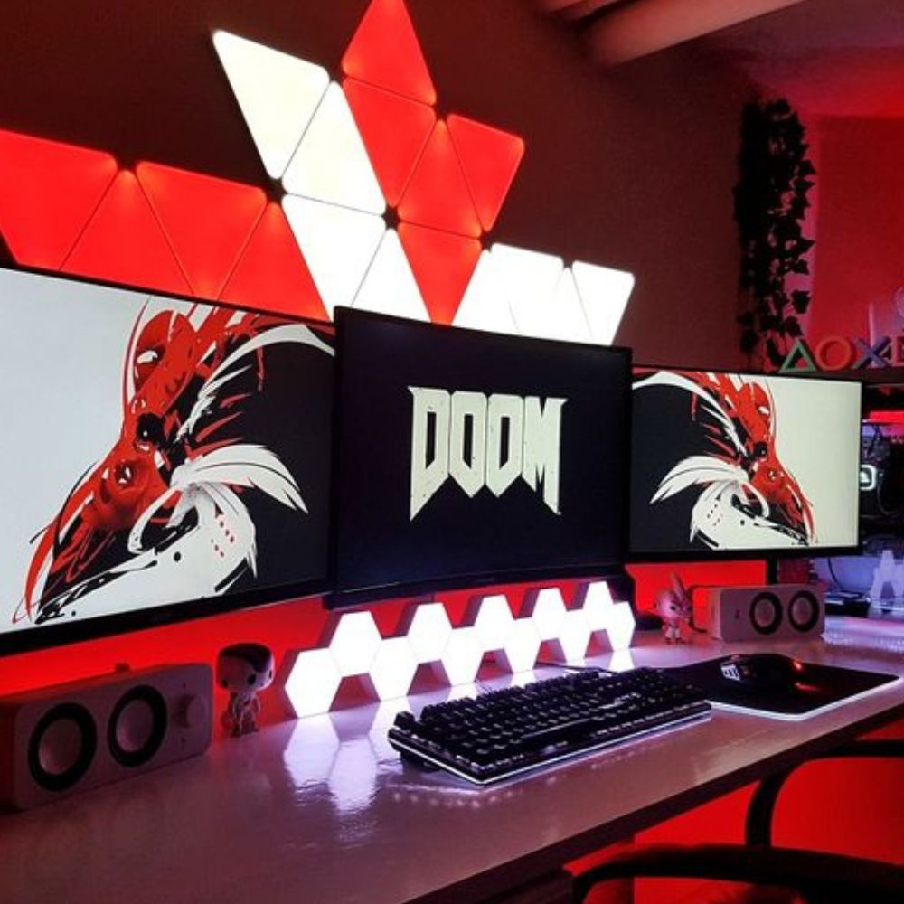
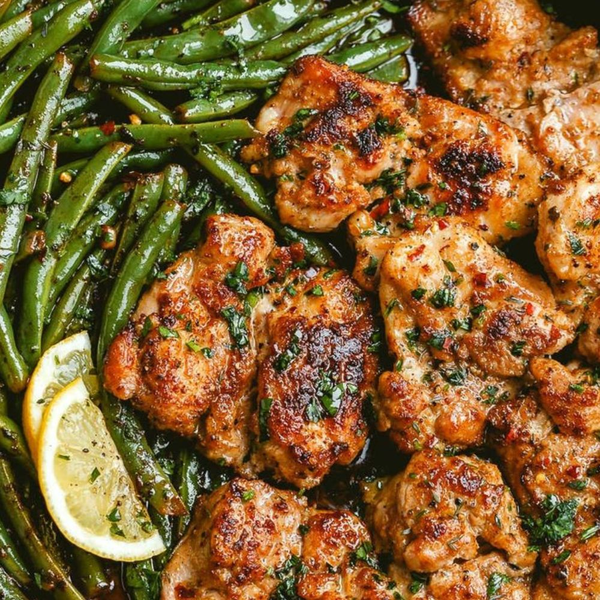

# OPADELE_EO_HW1
*This repo is for MMED-1054 Home work #1 assignment and there will be a collaborator on this repo. 
and i will create a HTML file name (RepoCollab) which will be an index page/home page to actually build out a one page site for my collab and I.
The RepoCollab html file is a way for my collab and I to keep coming back and making changes, strenghten our github use practice and getting more comfortable with wworking in the enviroment; as we keep learning more about html and eventually css to style our html.*

----------------------------------------------

<!--
This team name is subject to change when and if the collaborator suggests a new one
--->
*Team Name:*
# REPO-COLLAB  
 We popping! We coding!! We Lit

*Team Member 1*
# EMMANUEL OPADELE
**<u>About:</u>**
I come from the west part of africa, Nigeria.   I am a christian. My favorite colour is Red.

**<u>Hobbies:</u>**
**1.** Gaming 
**2.** Movies
**3.** Watching Tech,Food,Cars,Bike videos
**4.** Gym 
**5.** Eating Good Foods

**<u>Favorite Movies:</u>**
**1.** Red 1&2
**2.** After The Sunset 
**3.** Brooklyn Nine-Nine
**4.** Scorpion
**5.** Fast And Furious

**<u>Opinion About Fanshawe/Program:</u>**
**1.** I love the red theme 
**2.** so glad we got a bus card 
**3.** The program (IDP3), love it. 
**4.** It's a new experience 
**5.** I wonder how classes will be like during winter

[My Favorite Website ](http://www.youtube.com/)

<!--

.

This image code below will break for the obvious reasons... this is just a template.
--->

-------------------------------------------

*Team Member 2*
# MEMBER NAME
**<u>About:</u>**
text text text text text text text text text text text text text text text text text text text text text text text text text text text text text text text text text text text text 

**<u>Hobbies:</u>**
**1.** text text text text 
**2.** text text text text 
**3.** text text text text 
**4.** text text text text 
**5.** text text text text 

**<u>Favorite Movies:</u>**
**1.** text text text text 
**2.** text text text text 
**3.** text text text text 
**4.** text text text text 
**5.** text text text text

**<u>Opinion About Fanshawe/Program:</u>**
**1.** text text text text 
**2.** text text text text 
**3.** text text text text 
**4.** text text text text 
**5.** text text text text

<!--

.

This image code below will break for the obvious reasons... this is just a template.
--->

---------------------------------------------
&copy; <!--Team Name--> Repo-Collab 2023.
