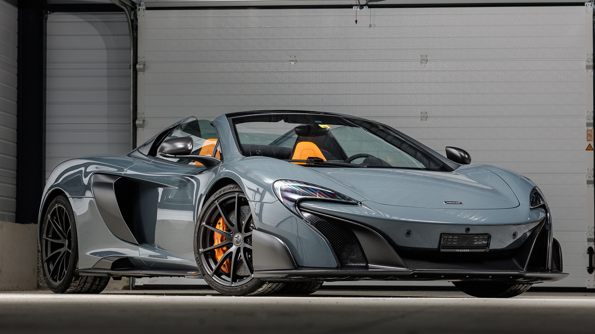
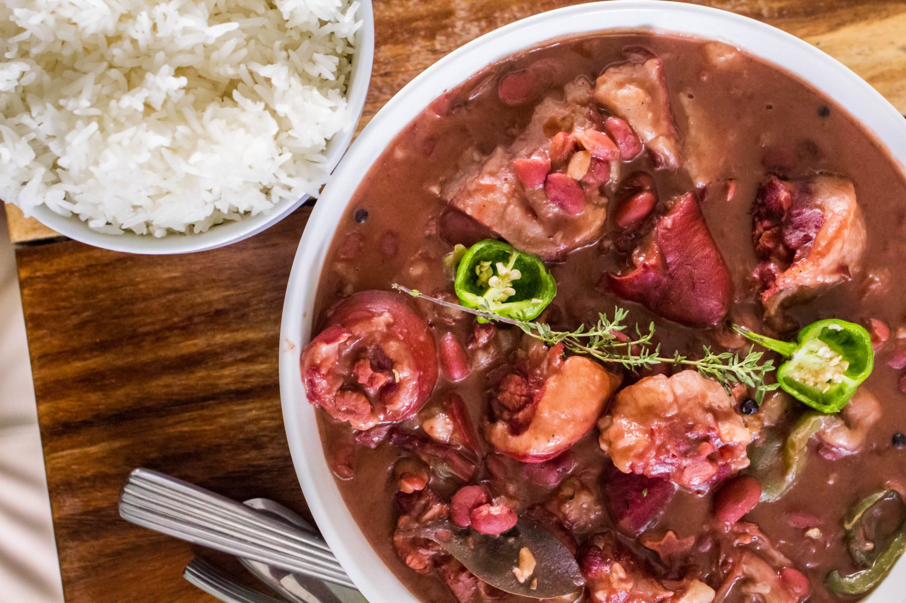
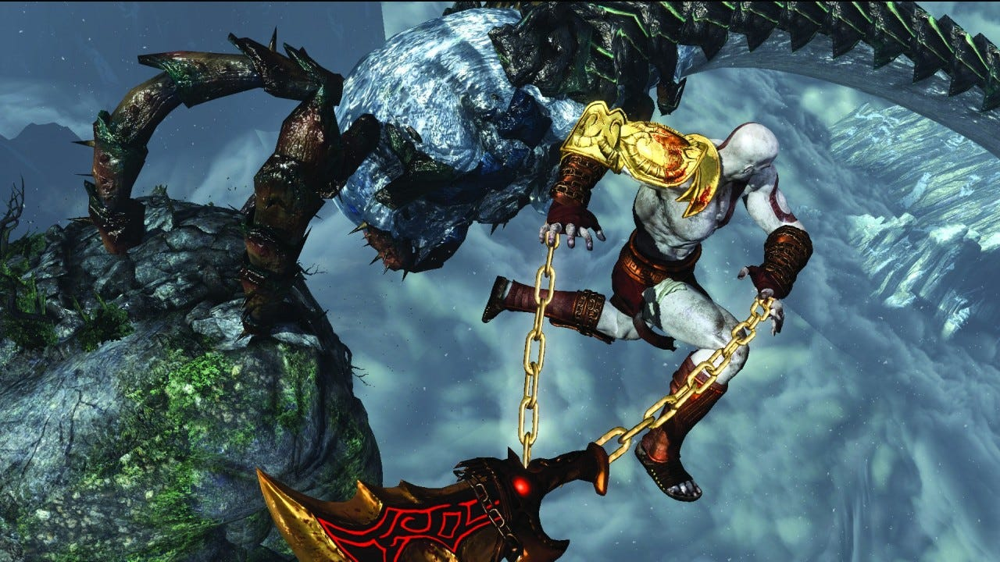

# OPADELE_EO_HW1
*This repo is for MMED-1054 Home work #1 assignment and there will be a collaborator on this repo. 
and i will create a HTML file name (RepoCollab) which will be an index page/home page to actually build out a one page site for my collab and I.
The RepoCollab html file is a way for my collab and I to keep coming back and making changes, strenghten our github use practice and getting more comfortable with wworking in the enviroment; as we keep learning more about html and eventually css to style our html.*

----------------------------------------------

<!--
This team name is subject to change when and if the collaborator suggests a new one
--->
*Team Name:*
# REPO-COLLAB  
 We popping! We coding!! We Lit

*Team Member 1*
# EMMANUEL OPADELE
**<u>About:</u>**
I come from the west part of africa, Nigeria.   I am a christian.  My favorite colour is Red.

**<u>Hobbies:</u>**  
**1.** Gaming  
**2.** Movies  
**3.** Watching Tech,Food,Cars,Bike videos  
**4.** Gym  
**5.** Eating Good Foods

**<u>Favorite Movies:</u>**  
**1.** Red 1&2  
**2.** After The Sunset  
**3.** Brooklyn Nine-Nine  
**4.** Scorpion  
**5.** Fast And Furious  

**<u>Opinion About Fanshawe/Program:</u>**  
**1.** I love the red theme  
**2.** so glad we got a bus card   
**3.** The program (IDP3), love it.  
**4.** It's a new experience  
**5.** I wonder how classes will be like during winter

[My Favorite Website ](http://www.youtube.com/)

<!--

.

This image code below will break for the obvious reasons... this is just a template.
--->

  
  

-------------------------------------------

*Team Member 2*
# Amari Buck
**<u>About:</u>**
Hello! I'm Amari Buck, and I'd like to share a bit about myself. This repository serves as a glimpse into my background, interests, and experiences. Feel free to explore and get to know me better.

**<u>Hobbies:</u>**  
**1.** Drawing  
**2.** Writing Music   
**3.** Playing Games  
**4.** Watching Anime  
**5.** Dancing

**<u>Favorite Movies:</u>**  
**1.** Bleach  
**2.** My Hero  
**3.** Black Clover  
**4.** Dragon Ball  
**5.** Demon slayer

**<u>Opinion About Fanshawe/Program:</u>**  
**1.** Modern Facilities  
**2.** Programs  
**3.** Industry Connections   

[My favorite Anime website](https://ww.kiss-anime.uk/home)

<!--

.

This image code below will break for the obvious reasons... this is just a template.
--->

  
  

---------------------------------------------
&copy; Repo-Collab 2023.
